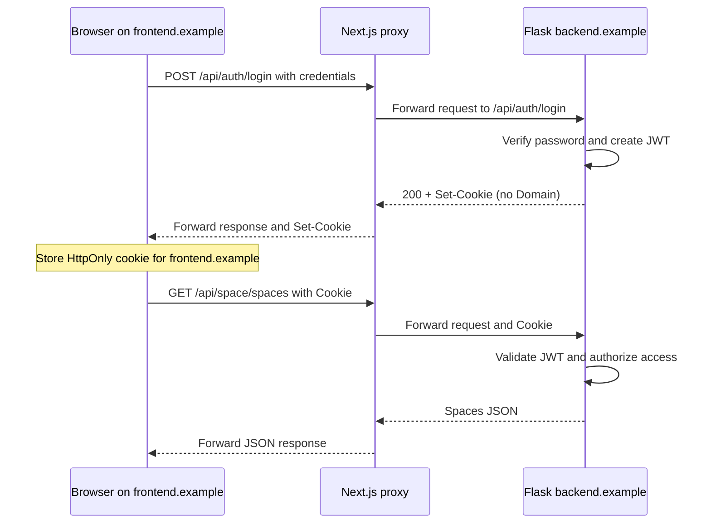

# Login failed in incognito after deployment

Recorded: September 16, 2026. The project owner confirmed the deployed fix works.
Domain names below are illustrative, not the actual deployment URLs.

## Interview answer: about one minute

“One challenge was keeping authentication working after deploying the Next.js
frontend and Flask backend on different sites. Login appeared successful, but in
incognito the next protected request returned 401 and sent the user back to
sign-in. The frontend called Flask directly, so authentication depended on a
third-party cookie. SameSite=None and credentialed requests could not override
the browser's cookie-blocking policy.

I added a same-origin API proxy using Next.js rewrites. The browser now calls
/api on the frontend host, and Next.js forwards the request to Flask. Flask still
issues and validates the JWT, but its host-only cookie reaches the browser through
the frontend response, so authentication no longer depends on third-party cookies.

I removed the separate frontend login flag and added expired-token cleanup to
prevent redirect loops. Tests covered cookie attributes, login, refresh, logout,
multipart uploads, and invalid sessions. After redeployment, the reported
incognito issue was resolved.”

## What happened before

```text
Page: https://frontend.example
  |
  | Browser directly POSTs to https://backend.example/api/auth/login
  v
Flask checks credentials and returns 200 + Set-Cookie: access_token=...
  |
  | Cookie belongs to backend.example in a cross-site browser request
  v
Browser privacy policy can block cookie storage or transmission
  |
  | Next protected request has no JWT cookie
  v
Flask returns 401 → Axios redirects the user to sign-in
```

The login success message meant the credentials were accepted. It did not prove
that the browser had stored the cookie or would send it on subsequent requests.
Chrome incognito blocks third-party cookies; SameSite=None permits cross-site
cookie use only when the browser's privacy policy also allows it.
See [MDN's third-party cookie guide](https://developer.mozilla.org/en-US/docs/Web/Privacy/Guides/Third-party_cookies).

The old JavaScript-created `ts_auth` cookie was just a frontend navigation flag.
It could not authenticate a Flask API request. Local storage likewise held a UI
identifier, not the JWT.

## How the fixed login works



1. Axios uses `baseURL: "/"`. Existing API functions already use paths such as
   `/api/auth/login`, so they now call the frontend origin.
2. Next.js rewrites `/api/:path*` to
   `${NEXT_PUBLIC_FLASK_API_URL}/api/:path*`. This is a server-side proxy, not a
   browser redirect. External rewrites preserve the browser-facing URL.
   See [Next.js 14 rewrites](https://nextjs.org/docs/14/app/api-reference/next-config-js/rewrites).
3. Flask creates the JWT and sets its cookie using `set_access_cookies`.
4. The proxy forwards `Set-Cookie`. Because the cookie has no `Domain`, the
   browser associates it with the response's frontend host. It does not see the
   internal upstream request to Flask.
5. The browser automatically includes the cookie on later matching frontend
   requests. The proxy forwards it to Flask, which validates the JWT.

The frontend and backend still run separately. Only the browser-facing API route
changed. Browser third-party cookie rules do not govern the server-to-server hop.

## Cookie settings and their purpose

| Setting | Current purpose |
| --- | --- |
| HttpOnly | Prevent frontend JavaScript from reading the JWT cookie. |
| Secure | Send the cookie over HTTPS in deployment. Local HTTP uses false. |
| SameSite=Lax | Allow the ordinary first-party flow while restricting cross-site sending. |
| No Domain | Scope the cookie to the host of the browser-facing response. |
| Path=/ | Make the cookie available to both `/api` and dashboard navigation. |
| Three-day lifetime | Match the configured JWT lifetime and login cookie maximum age. |

These attributes control different aspects of cookie handling; HttpOnly does not
stop the browser from sending a cookie. See [MDN Set-Cookie reference](https://developer.mozilla.org/en-US/docs/Web/HTTP/Reference/Headers/Set-Cookie).

Next.js middleware checks cookie presence to guide navigation. **It does not
validate the JWT or replace backend authorization.** Flask remains responsible
for authenticating protected API requests.

## Refresh, logout, and expired sessions

- Refresh: the browser sends the frontend-host cookie again. Middleware allows
  dashboard navigation, and Flask validates subsequent API requests.
- Logout: Flask sends an expired cookie through the proxy with matching host/path
  settings. The browser removes it.
- Invalid or expired token: Flask returns 401 and expires the unusable cookie.
  Axios clears its UI identifier and redirects to sign-in. Clearing the cookie
  prevents middleware from repeatedly redirecting back to the dashboard.
- Wrong password: the login API's 401 is shown as an error without the general
  session-expiry redirect.

## Where it is implemented

- [Next.js rewrite](../../Frontend/next.config.mjs)
- [Same-origin Axios client](../../Frontend/src/utils/apiClient.ts)
- [Frontend navigation middleware](../../Frontend/src/middleware.ts)
- [Cookie settings and JWT error callbacks](../../Backend/config/auth.py)
- [Login and logout cookie handling](../../Backend/services/auth_services.py)
- [Backend regression tests](../../Backend/tests/test_auth_proxy.py)
- [Deployment instructions](../../Frontend/README.md)

## Verification and outcome

- Backend tests cover login cookie attributes, authenticated requests, secure
  cookies, logout, and missing/expired/invalid JWTs without requiring a database.
- An isolated Next.js/Flask browser test checked the real proxy with mocked
  database access: first-party HttpOnly cookies, authentication after refresh,
  query forwarding, a 64 KiB multipart upload, logout, rejection of `ts_auth` as
  authentication, and invalid-cookie cleanup.
- Proxy configuration checks covered valid URLs, missing production settings,
  invalid backend origins, and the development fallback.
- TypeScript passed. Lint reported only three pre-existing hook warnings.
- The project owner confirmed that authentication works after deployment.

The local upload test does not establish the hosting provider's production
upload limits. No latency or performance improvement was measured.

## Interview follow-up questions

**Why didn't CORS configuration fix it?**
CORS and cookie privacy are separate browser rules. Allowing a credentialed
cross-origin response does not override third-party cookie blocking. The proxy
makes browser API calls same-origin; existing CORS settings can remain for other
direct backend clients.

**Why not put the JWT in localStorage?**
That would make the token readable by JavaScript. The proxy preserves the
existing HttpOnly-cookie design without requiring the browser to accept
third-party authentication cookies.

**Is the backend URL secret?**
No. `NEXT_PUBLIC_FLASK_API_URL` is intentionally public and also supplies anonymous
embed URLs. Sharing that variable avoids duplicate configuration. The crucial
point is that Axios calls `/api`, not the backend origin directly. A future
private upstream address would justify a separate server-only variable.

**Are different ports the reason cookies were blocked?**
No. Origins include ports, but cookies are not scoped by port. Cross-origin and
cross-site are different concepts: two localhost ports are different origins
but can use cookies for the same host. Unrelated deployed sites created the
third-party-cookie dependency. `localhost` and `127.0.0.1` are different hosts.

**What are the tradeoffs?**
API requests have an additional server hop. The frontend host must support
rewrites and may limit upload sizes and request duration. Public embeds still
load directly from Flask because they do not need authentication. A static-only
frontend export cannot provide this proxy.

**Does this solve every authentication security issue?**
No. It solves this cookie-delivery failure. JWT validation, resource ownership
checks, XSS prevention, and CSRF controls remain separate concerns. The current
backend explicitly disables the JWT library's CSRF protection; do not describe
the proxy or SameSite=Lax as a complete CSRF solution.
